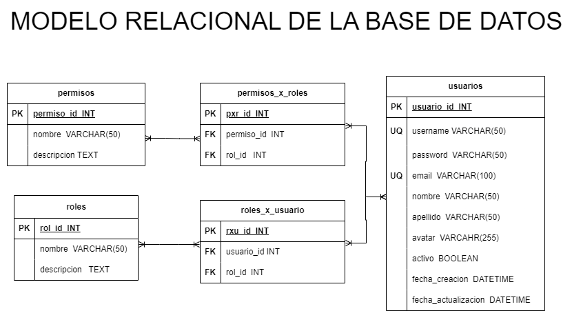

# Autenticacion

## Entidades:

### usuarios (ED):
- usuario_id INT **PK**
- username VARCHAR(50)  **UQ**
- password VARCHAR(50) 
- email   VARCHAR(100)  **UQ**
- nombre VARCHAR(50) 
- apellido  VARCHAR(50) 
- avatar VARCHAR(255) 
- activo BOOLEAN
- fecha_creacion  DATETIME
- fecha_actualizacion DATETIME

### roles (EC):
- rol_id  INT **PK**
- nombre VARCHAR(50) 
- descripcion TEXT

### permisos (EC):
- permiso_id  INT**PK**
- nombre VARCHAR(50) 
- descripcion TEXT

### roles_x_usuario (EP):
- rux_id  INT **PK**
- usuario_id  INT **FK**
- rol_id  INT **FK**

### permisos_x_roles (EP):
- pxr_id  INT **PK**
- permiso_id  INT **FK**
- rol_id  INT **FK**

## Relacion del sistema:
1. Usario **tiene** Roles (_N a N_)
1. Usario **tiene** Permisos (_N a N_)

## Modelo Relacional de la Base de Datos:

## Reglas de Negocio:

### Usuarios:
- Crear un usuario
- Leer todos los usuarios
- Leer un usuario en particular
- Actualizar un usuario
- Validar un usuario
- Habilitar un usuario
- Actualizar datos de un usuario
- Actualizar Password de un usuario
- Eliminar un usuario

### Roles:
- Crear todos los roles
- Leer todos los roles
- Leer un rol en particular
- Actualizar un rol 
- Eliminar un rol

### Permisos:
- Crear todos los permisos
- Leer todos los permisos
- Leer un permiso en particular
- Actualizar un permiso 
- Eliminar un permiso

### Roles_x_usuario:
- Crear todos los rxu
- Leer todos los rxu
- Leer un rxu en particular
- Leer todos los rxu de un usuario
- Eliminar un permiso

### Permisos_x_rol:
- Crear todos los pxr
- Leer todos los pxr
- Leer un pxr en particular
- Leer todos los pxr de un rol
- Eliminar un pxr