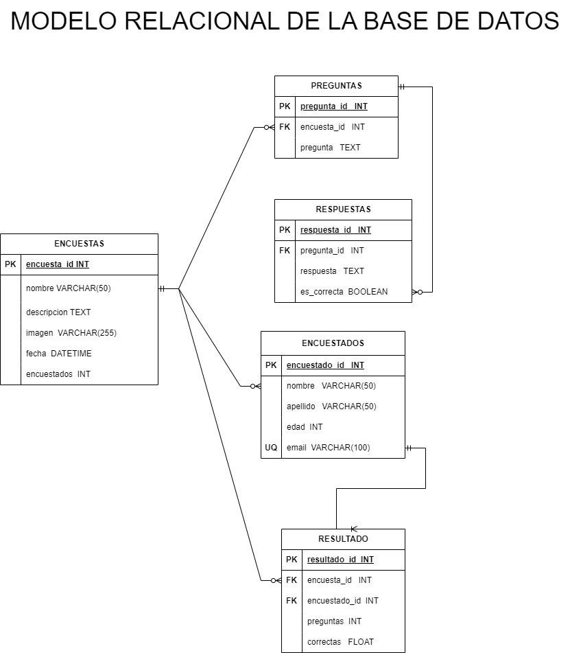

# Sistema de Encuesta

## Identificacion de entidades:

### Encuestas (ED)
- encuesta_id INT **PK**
- nombre VARCHAR(50)
- descripcion TEXT
- imagen VARCHAR(255)
- fecha TIME
- encuestados INT

### Preguntas (ED)
- pregunta_id INT **PK**
- encuesta_id INT **FK**
- pregunta TEXT

### Respuesta (ED)
- respuesta_id INT **PK**
- pregunta_id INT **FK**
- respuesta TEXT
- es_correcta BOOLEAN

### Encuestados 
- encuestado_id INT **PK**
- nombre VARCHAR(50)
- apellido VARCHAR(50)
- edad INT
- email VARCHAR(100) **UQ**

### Resultado 
- resultado_id INT **PK**
- encuesta_id INT **FK**
- encuestado_id INT **FK**
- preguntas INT
- correctas FLOAT

## Relacion del sistema:
1. Encuestas **tener** preguntas (_1 a N_)
1. Encuestas **tener** encuestados (_1 a N_)
1. Encuestas **tener** resultados(_1 a N_)
1. Preguntas **tener** respuestas (_1 a N_)
1. Encuestas **tener** respuestas (_1 a N_)

## Modelo Relacional de la Base de Datos:

## Logica del Negocio (CRUD):

### Encuestas:
- Crear una encuesta
- Leer todas las encuestas
- Leer una encuesta en particular
- Actualizar los datos de una encuesta
- Eliminar una encuesta
- Incrementar en 1 el valor de encuestados cada vez que un encuestado responda la encuesta

### Preguntas: 
- Crear una pregunta
- Leer todas las preguntas
- Leer una pregunta en particular
- Actualizar los datos de una pregunta
- Eliminar una pregunta

### Respuestas: 
- Crear una respuesta
- Leer todas las respuestas
- Leer una respuesta en particular
- Actualizar los datos de una respuesta
- Eliminar una respuesta
- Setear de un conjunto de respuestas dirigidas hacia una misma pregunta la que sea como verdadera cambiandole el es_correcta como TRUE ( Esto si por DEFAULT el valor BOOLEAN es False)

### Encuestados: 
- Crear un registro de Encuestados
- Leer todas las encuestados
- Leer un encuestado en particular
- Actualizar los datos de un encuestado
- Eliminar una encuestado

### Resultado: 
- Crear un registro de Resultado
- Leer todas los resultados
- Leer un resultado en particular
- Actualizar los datos de un resultado
- Eliminar un resultado
- Calcular el porcentaje de preguntas correctas que tuvo el encuestado