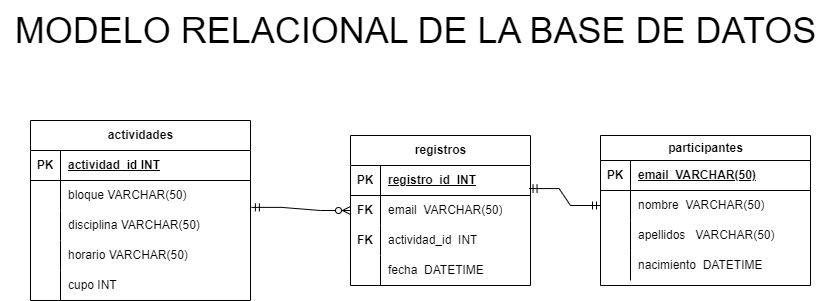

# Entrena Tu Glamour
#### EJEMPLO REAL DE UNA BD DE UN TRABAJO

## Entidades:

### Actividades (EC):
- actividad_id INT **PK**
- bloque VARCHAR(50)
- disciplina VARCHAR(50)
- horario VARCHAR(50)
- cupo INT

### Participantes (ED):
- email VARCHAR(50) **PK**
- nombre  VARCHAR(50)
- apellidos VARCHAR(50)
- nacimiento DATETIME

### Registros (ED | EP):
- registro_id INT **PK**
- email VARCHAR(50) **FK**
- actividad_id INT **FK**
- fecha DATETIME

## Relacion del sistema:
- Participante **crea** Registro (_1 : 1_)
- Actividad **asigna** Registro (_1 : N_)

## Modelo Relacional de la Base de Datos:

## Reglas de Negocio:

### Actividades
- Crear una actividad
- Leer una actividad
- Leer todas las actividades
- Actualizar una actividad
- Eliminar una actividad

### Participantes:
- Crear un partipante
- Leer un participante
- Leer todas los participantes
- Actualizar un participante
- Eliminar un participantes

### Registros:
- Crear un registro
- Leer un registro
- Leer tods los registros
- Leer todas los registro de una actividad
- Actualizar un registro
- Eliminar un registro

### Logica y Validaciones de Requisitos:

- Registrar un participante implica:
  - Validar el cupo de la actividad
  - Insertar datos a las entidades participantes y registros
  - Restarle uno al atributo cupo de la entidad actividades
- Listar registros
- Eliminar participantes implica:
  - Eliminar datos a las entidades participantes y registros
  - Sumarle uno al atributo cupo de la entidad actividades