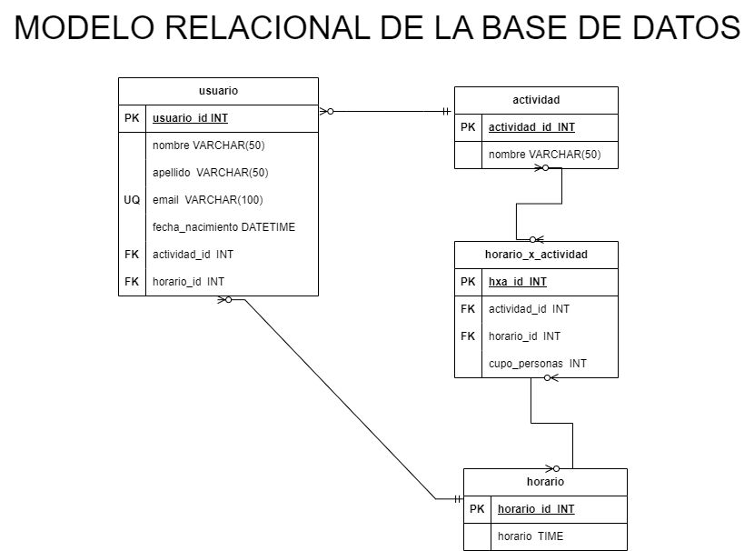

# Evento Entrenamiento 

## Entidades:

### Usuarios (ED):
- usuario_id INT **PK**
- nombre VARCHAR(50)
- apellido VARCHAR(50)
- email VARCHAR(100) **UQ**
- fecha_nacimiento DATETIME
- actividad_id INT **FK**
- horario_id INT **FK**

### Actividad (EC):
- actividad_id INT **PK**
- nombre VARCHAR(50)

### Horarios (EC):
- horario_id INT **PK**
- horario TIME

### Horarios_x_actividad (EP)
- hxa_id INT **PK**
- actividad_id INT **FK**
- horario_id INT **FK**
- cupo_personas INT

## Relaciones del Sistema:
1. Usuario **realiza** Actividad (_N:1_)
1. Usuario **posee** Horario (_N:1_)
1. Actividad **tiene** Horario (_N:N_)

## Modelo Relacional de la Base de Datos:

## Reglas de Negocio (CRUD):

### Usuarios:
- Crear un usuario
- Leer un usuario
- Leer todos los usuarios
- Actualizar un usuario
- Eliminar un usuario
- Validar que no exista un email antes de crear un usuario

### Actividad:
- Crear una actividad
- Leer una actividad
- Leer todos las actividades
- Actualizar una actividad
- Eliminar una actividad

### Horarios:
- Crear un horario
- Leer un horario
- Leer todos los horarios
- Actualizar un horario
- Eliminar un horario

### horarios_x_actividad:
- Crear un hxa
- Leer todos los  horarios de una actividad
- Eliminar un hxa

