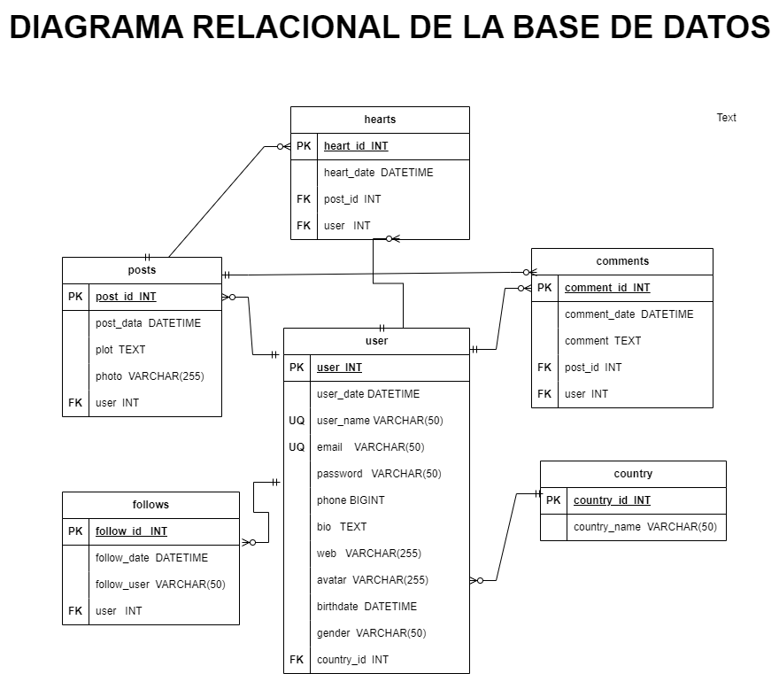

# FabriGram

## Entidades:

### Posts (ED):
- post_id  INT **PK**
- post_data DATETIME
- plot TEXT
- photo VARCHAR(255)
- user INT **FK**

### User  (ED):
- user INT **PK**
- user_date DATETIME
- user_name VARCHAR(50) **UQ**
- email  VARCHAR(50)  **UQ**
- password VARCHAR(50)
- phone  BIGINT
- bio TEXT
- web VARCHAR(255)
- avatar VARCHAR(255)
- birthdate DATETIME
- gender VARCHAR(50)
- country_id  INT **FK**

## Comments (ED/EP):
- comment_id INT **PK**
- comment_date DATETIME
- comment TEXT
- post_id  INT **FK**
- user  INT **FK**

## Hearts (ED/EP):
- heart_id INT **PK**
- heart_date DATETIME
- post_id INT **FK**
- user INT **FK**

## Follows (ED):
- follow_id INT **PK**
- follow_date DATETIME
- follow_user VARCHAR(50)
- user INT **FK**

## Country (EC):
- country_id INT **PK**
- country_name VARCHAR(50)

## Relacion del sistema:
1. User **publish** Posts (_1:N_)
1. User **write** Comments (_1:N_)
1. User **put** Hearts (_1:N_)
1. User **have** Follows (_1:N_)
1. User **have** Country (_N:1_)
1. Post **have** Comments (_1:N_)
1. Post **have** Hearts(_1:N_)

## Modelo Relacional de la base de datos:

## Reglas del Negocio (CRUD):

### Posts:
- Crear un post 
- Leer todos los post
- Leer un post en particular
- Leer los post de un user
- Actualizar el plot de un post
- Eliminar un post

### Usuarios:
- Crear un usuario 
- Leer todos los usuarios
- Leer un usuario en particular
- Actualizar datos de un usuario
- Actualizar el password de un usuario
- Eliminar un usuario
- Validar que el mail o el user_name no existan con anterioridad antes de crear un nuevo usuario

### Comments:
- Crear un comentario  en un post
- Leer todos los comentarios de un post
- Leer un comentario en particular de un post
- Contar el numero de comentarios de un post
- Actualizar un comentario en un post
- Eliminar un comentario en un post

### Hearts:
- Crear un heart en un post
- Contar el numero de hearts de un post
- Eliminar un heart de  un post

### Follows:
- Crear un follow de un user
- Contar  todos los follows de un user
- Contar todos los followings de un user
- Eliminar un follow de un user

### Country:
- Crear un country 
- Leer todos los country
- Leer un country en particular
- Actualizar un country
- Eliminar un country