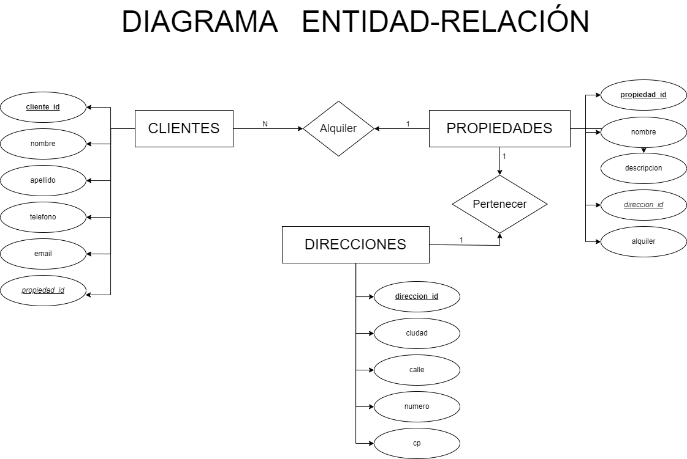
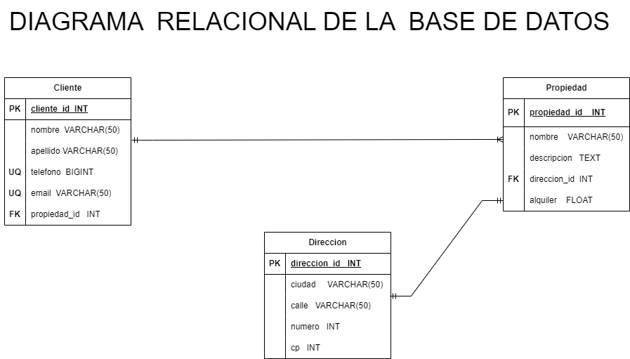

# Inmobiliaria:

## Entidades:

### Cliente (ED):
- cliente_id INT **PK**
- nombre VARCHAR(50)
- apellido  VARCHAR(50)
- telefono BIGINT
- email   VARCHAR(50)
- propiedad_id INT **FK**

### Propiedad (EC):
- propiedad_id  INT**PK**
- nombre  VARCHAR(50)
- descripcion TEXT
- direccion_id INT **FK**
- alquiler FLOAT

### Direccion (EC):
- direccion_id  INT **PK**
- ciudad  VARCHAR(50)
- calle  VARCHAR(30)
- numero INT
- cp  INT

## Relaciones del Sistema:
- Un cliente puede _alquilar_ una o varias propiedades , y una propiedad solo puede ser _alquilada_ por un cliente(1:N)
- Una propiedad puede _tener_ solo una direccion y una direccion _pertenece_ a una propiedad(1:1)

## Modelo Entidad - Relacion:

## Modelo Relacional de la Base de Datos:

## Reglas del Negocio (CRUD)

### Cliente
- Crear registro cliente
- Recuperar la informacion de cliente/s s/una condicion determinada
- Actualizar la informacion de cliente/s s/una condicion determinada
- Eliminar un registro/s de cliente/s s/una condicion determinada

### Propiedad
- Crear registro Propiedad
- Recuperar la informacion de propiedad/es s/una condicion determinada
- Actualizar la informacion de propiedad/es s/una condicion determinada
- Eliminar un registro/s de propiedad/es s/una condicion determinada

### Direccion
- Crear registro Direccion
- Recuperar la informacion de direccion/es s/una condicion determinada
- Actualizar la informacion de direccion/es s/una condicion determinada
- Eliminar un registro/s de direccion/es s/una condicion determinada