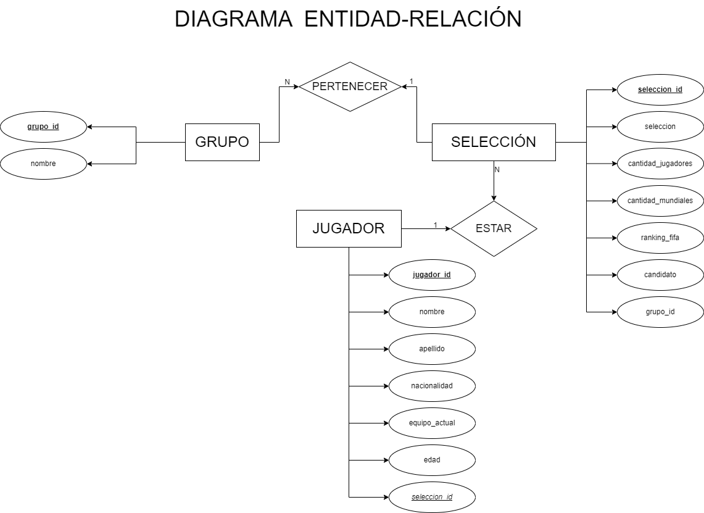
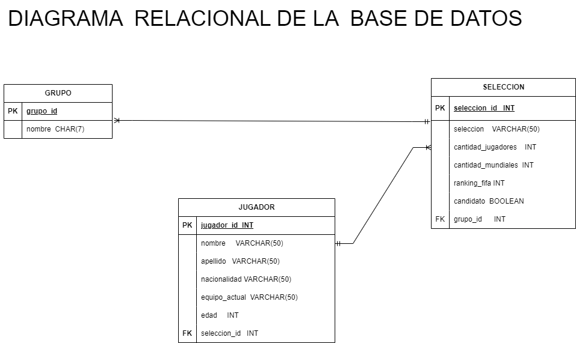

# Mundial

## Entidades:

### Grupos (EC)
- grupo_id  INT **PK**
- nombre CHAR(7)

### Seleccion (ED)
- seleccion_id INT **PK**
- grupo_id  INT**FK**
- seleccion VARCHAR(50)
- cantidad_jugadores INT
- cantidad_mundiales INT DEFAULT 0
- ranking_fifa INT  **UQ**
- candidato BOOLEAN DEFAULT FALSE

### Jugador (ED)
- jugador_id  INT **PK**
- nombre VARCHAR(50)
- apellido VARCHAR(50)
- nacionalidad VARCHAR(50)
- equipo_actual VARCHAR(50)
- edad INT  
- seleccion_id  INT **FK**

## Relacion del sistema :
- Un jugador _pertenece_ a una sola seleccion pero en a una seleccion _pertenecen_ diversos jugadores(1:N)
- Una seleccion _estar_ un solo grupo pero en un grupo pueden _estar_ muchas selecciones(1:N)

## Modelo Entidad-Relacion:

## Modelo Relacional de la Base de Datos:

## Reglas del Negocio(CRUD):

### Grupos:
- Crear registro Grupos
- Recuperar la informacion de grupo/s s/una condicion determinada
- Actualizar la informacion de grupo/s s/una condicion determinada
- Eliminar un registro/s de grupo/s s/una condicion determinada

### Seleccion:
- Crear registro Seleccion
- Recuperar la informacion de seleccion/es s/una condicion determinada
- Actualizar la informacion de seleccion/es s/una condicion determinada
- Eliminar un registro/s de seleccion/es s/una condicion determinada

### Jugador: 
- Crear registro Jugador
- Recuperar la informacion de jugador/es s/una condicion determinada
- Actualizar la informacion de jugador/es s/una condicion determinada
- Eliminar un registro/s de jugador/es s/una condicion determinada

