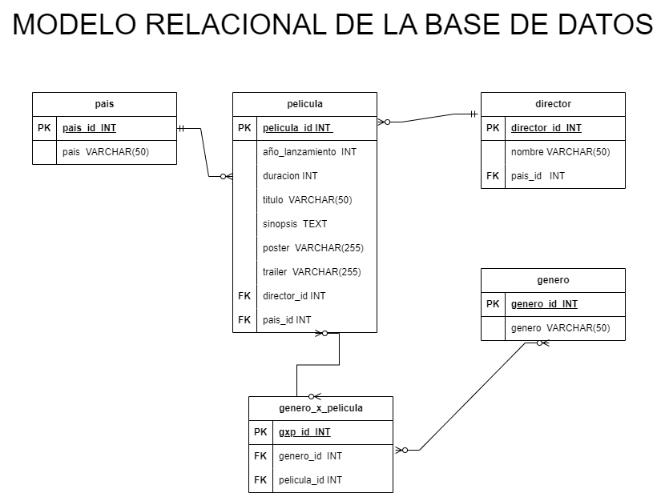

# Peliculas

## Entidades:

### Pelicula (ED):
- pelicula_id INT **PK**
- año_lanzamiento INT
- duracion INT
- titulo VARCHAR(50)
- sinopsis TEXT
- poster VARCHAR(255)
- trailer VARCHAR(255)
- director_id INT **FK**
- pais_id INT **FK**

### Director (ED):
- director_id INT **PK**
- nombre VARCHAR(50)
- pais_id INT **FK**

### Pais (EC):
- pais_id INT **PK**
- pais VARCHAR(50)

## Genero (EC):
- genero_id INT **PK**
- genero VARCHAR(50)

## genero_x_pelicula:
- gxp_id INT **PK**
- genero_id INT **FK**
- pelicula_id  INT **FK**

## Relacion del Sistema:
1. Pelicula **tiene** Director (_N:1_) 
1. Pelicula **tiene** Pais (_N:1_) 
1. Pelicula **tiene** Genero (_N:N_)
1. Director **tiene** Pais(_N:1_)

## Modelo Relacional de la Base de Datos

## Reglas del Negocio (CRUD):

### Pelicula
- Crear una pelicula
- Mostrar una pelicula
- Mostrar todas las peliculas
- Actualizar una pelicula
- Eliminar una pelicula

### Director
- Crear una director
- Mostrar un director
- Mostrar todos los directores
- Actualizar un director
- Eliminar un director

### Pais
- Crear una pais
- Mostrar una pais
- Mostrar todos los paises
- Actualizar un pais
- Eliminar un pais

### Genero
- Crear un genero
- Mostrar un genero
- Mostrar todas los generos
- Actualizar un genero
- Eliminar un genero

### genero_x_pelicula
- Crear un gxp
- Leer los generos de una pelicula
- Eliminar un gxp