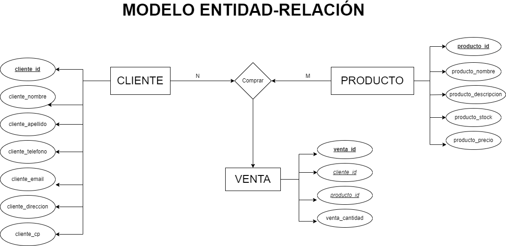
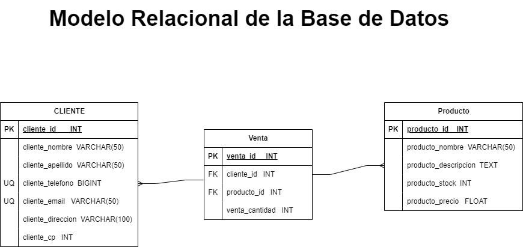

# Sistema de Ventas 

## Entidades :

### Cliente (ED)
- cliente_id INT **PK**
- cliente_nombre VARCHAR(50)
- cliente_apellido VARCHAR(50)
- cliente_telefono BIGINT
- cliente_email VARCHAR(50)
- cliente_direccion VARCHAR(100)
- cliente_cp INT

### Producto (EC)
- producto_id  INT **PK**
- producto_nombre VARCHAR(50)
- producto_descripcion TEXT
- producto_stock INT
- producto_precio FLOAT

### Venta  (EP)
- venta_id INT **PK**
- cliente_id INT **FK**
- producto_id  INT **FK**
- venta_cantidad INT

## Relaciones del Sitema:
- El cliente puede _comprar_ muchos productos y a su vez los productos pueden ser _comprados/vendidos_ por muchos clientes (N:M) . La resultante de esta relacion es la tabla intermedia llamada _**Ventas**_

## Modelo Entidad-Relacion

## Modelo Relacional de la base de Datos

## Reglas de Negocio (CRUD) :

### Clientes:
- Crear registro clientes
- Recuperar el/los cliente/s s/una condicion.
- Actualizar la informacion de un/os cliente/s s/una condicion.
- Eliminar un/os cliente/s determinado/s

### Producto:
- Crear registro Producto
- Recuperar el/los producto/s s/una condicion.
- Actualizar la informacion de un/os producto/s s/una condicion.
- Eliminar un/os producto/s determinado/s

## Ventas:
- Crear registro Ventas
- Recuperar el/los registro/s de venta/s s/una condicion.
- Actualizar la informacion de un/os registro/s de venta/s s/una condicion.
- Eliminar un/os registros de venta/s determinado/s
