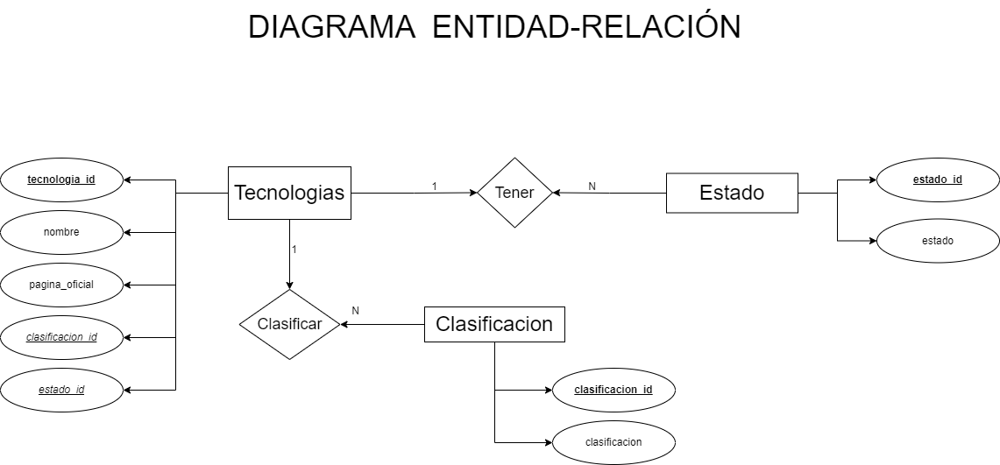
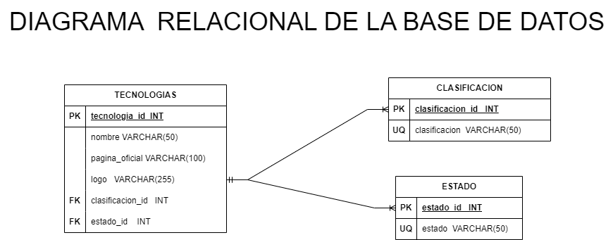

# Stack Tecnologico

## Entidades:

### Clasificacion:
- clasificacion_id  INT  **PK**
- clasificacion VARCHAR(50) **UQ**

### Estado:
- estado_id  INT  **PK**
- estado VARCHAR(50) **UQ**

### Tecnologia:
- tecnologia_id  INT  **PK**
- nombre VARCHAR(50)
- pagina_oficial VARCHAR(100)
- logo VARCHAR(255)
- clasificacion_id  INT **FK**
- estado_id INT **FK**

## Relacion del sistema:
- Una tecnologia puede _tener_ un estado pero un estado puede _tener_ varias tecnologias(1:N)
- Una tecnologias pueder ser _clasificada_ en una clasificacion pero una clasificacion puede _clasificar_ varias tecnologias (1:N)

## Diagrama Entidad-Relacion:

## Diagrama Relacional de la Base de Datos:

## Reglas del negocio (CRUD):

### Tecnologia:
- Crear registro tecnologia
- Recuperar la informacion de una/s tecnologia/s s/una condicion determinada
- Actualizar la informacion de una/s tecnologia/s s/una condicion determinada
- Eliminar un/os registro/s de tecnologia/s s/una condicion determinada

### Estado:
- Crear registro estado
- Recuperar la informacion de un/os estado/s s/una condicion determinada
- Actualizar la informacion de un/os estado/s s/una condicion determinada
- Eliminar un/os registro/s de estado/s s/una condicion determinada

### Clasificacion:
- Crear registro clasificacion
- Recuperar la informacion de una/s clasificacion/es s/una condicion determinada
- Actualizar la informacion de una/s clasificacion/es s/una condicion determinada
- Eliminar un/os registro/s de clasificacion/es s/una condicion determinada

